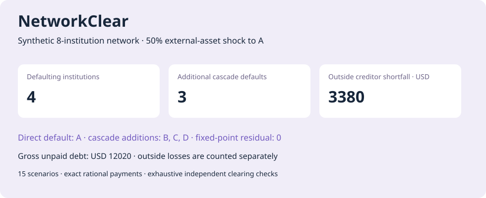

# NetworkClear

[](https://github.com/dev-belly/NetworkClear/actions/workflows/ci.yml)


**Counterparty contagion and debt clearing with exact payment certificates and an independent small-network oracle.**

If an institution loses external assets, which debts remain unpaid after the network clears? NetworkClear implements pro-rata Eisenberg–Noe clearing, records the computational default sequence and separates **gross unpaid debt** from **outside creditor shortfall**.

**[Try the live clearing report](https://dev-belly.github.io/NetworkClear/)** · [中文面试讲解](docs/INTERVIEW.md)



## Quick start

```bash
git clone https://github.com/dev-belly/NetworkClear.git
cd NetworkClear
python -m venv .venv
source .venv/bin/activate  # Windows: .venv\Scripts\activate
python -m pip install -e .
networkclear demo --out output/demo
networkclear verify output/demo
python -m http.server 8000 --directory output/demo
```

Open `http://localhost:8000` to switch stress scenarios, inspect recoveries and view the liability matrix. Saved evidence is in [examples/demo](examples/demo); download or serve the HTML locally.

## Model contracts

| Component | Behavior |
|---|---|
| Inputs | Nonnegative integer USD cents; directed nominal debts between named institutions |
| Clearing | Limited liability, pro-rata repayment and debt priority over equity |
| Outside creditors | Every debtor owes a positive outside amount; closed nonregular cycles are rejected |
| Arithmetic | Exact rational payments; rounded dollars are display only |
| Solver | Monotone fictitious-default sets and exact active-system solves |
| Certificate | Bounded payments satisfy the fixed-point equation with exactly zero residual |
| Conservation | External assets = outside payments + final network equity |
| Independent oracle | Exhaustive default-regime enumeration for at most eight institutions |
| Replay | Source network, shocks, payments, flows, rounds, HTML and semantic verification |

Rounds are computation steps, **not real-world contagion time**. Payments may be fractional cents: this is a continuous-money mathematical model, not a cent-quantized settlement engine. Larger reports disclose that exhaustive checking was not performed.

## Synthetic demo

Eight institutions combine a debt chain and a feedback cycle. Fifteen scenarios cover an anchor shock grid, broad stress, cycle stress and two allocations of the same USD 2,000 injection budget. These are illustrative allocations, not a global optimization result.

At a 50% external-asset shock to A:

- A defaults directly; **B, C and D** default through the network.
- Final chain payments are USD **5,000 → 4,500 → 4,100 → 3,780**.
- Gross unpaid nominal debt is **USD 12,020**, including internal exposures.
- Outside creditor shortfall is **USD 3,380**. Treating gross internal unpaid debt as a social loss would double-count propagation.

All fifteen scenarios are checked against all 256 candidate default regimes. Tests also compare 100 seeded small networks with the independent oracle, check permutation invariance and monotone shock effects, and reconcile every debt flow.

## Custom runs and validation

```bash
networkclear run --network src/networkclear/data/network.json \
  --scenarios src/networkclear/data/scenarios.json --out output/custom
python -m pip install -e '.[dev]'
python -m unittest discover -s tests -v
ruff check src tests scripts
ruff format --check src tests scripts
networkclear verify examples/demo
```

No runtime dependencies, credentials or downloads are needed. CI runs tests, committed report replay and installed-wheel smoke tests on Python 3.11–3.13. The verifier rejects rehashed output tampering; it does not authenticate inputs or detect a complete coordinated rewrite.

## 中文说明

银行网络风险与交易对手分析项目，重点是 **债务方向、比例清偿、直接违约与新增传染违约、精确方程证书、外部资金勾稽、内部债务重复计算**，与贷款违约预测项目互补。

- [方法、输入结构与边界](docs/METHODOLOGY.md)
- [三分钟面试讲解](docs/INTERVIEW.md)
- [可复算演示](examples/demo)
- Eisenberg & Noe (2001), [Systemic Risk in Financial Systems](https://pubsonline.informs.org/doi/10.1287/mnsc.47.2.236.9835), Management Science 47(2), 236–249; [paper copy](https://ms.mcmaster.ca/tom/Research%20Papers/EiseNoe01.pdf).

Code and synthetic fixtures: MIT. Data do not represent real banks. No collateral, seniority, fire sales, bankruptcy costs or dynamic liquidity are modeled; no regulatory or actual-business benefit is claimed.
